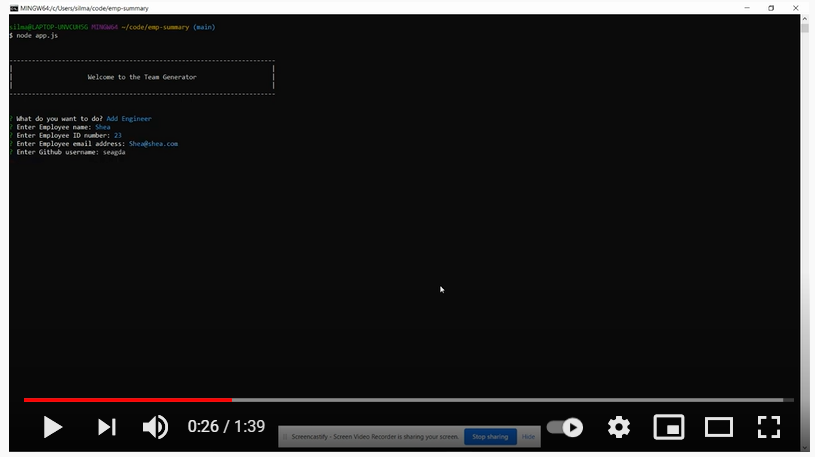
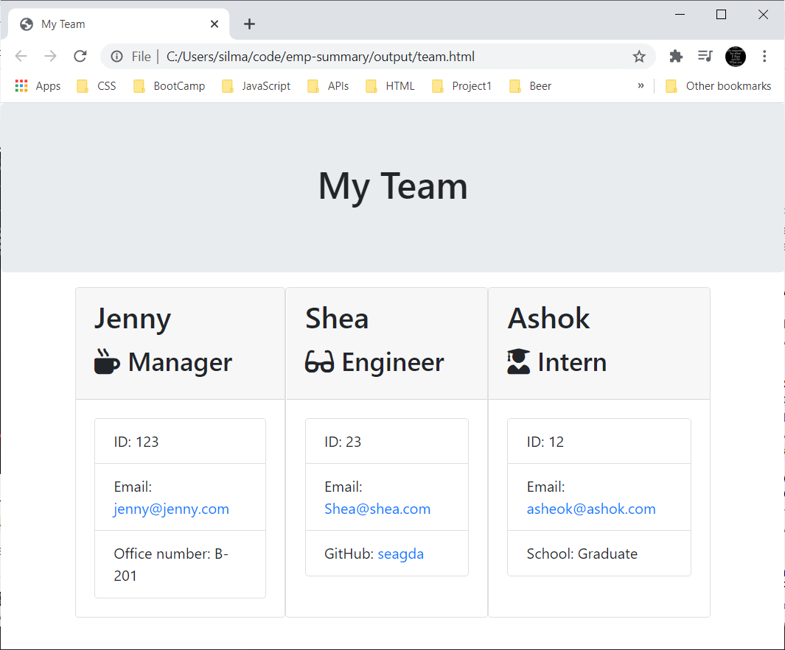

# TEAM SUMMARY PAGE BUILDER

## Description
-------------
This CLI application is build in Node.js to
  1. accept command-line user input, with the following validation rules:
    * All fields must be filled out
    * IDs must be numberical
    * Emails verified using a custom REGEX key developed by [John Jacobson](http://github.com/johndjake)
  2. create employee objects using a series of employee classes,
  3. store objects in an array,
  4. create/update a team page built in Bootstrap from previously written templates.  
-------------
## User Story

As a manager
I want to generate a webpage that displays my team's basic info
so that I have quick access to emails and GitHub profiles.

------------
## Dependencies

This CLI app requires the following NPMs:
* inquirer 
-------------
## Demonstration

### Click the image to watch the video:

### Our Expected HTML Output
 
